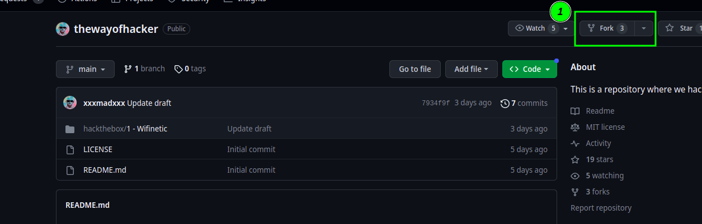
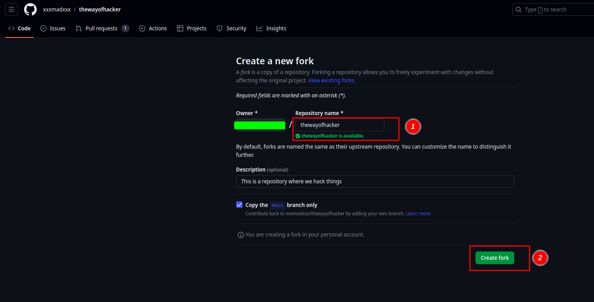
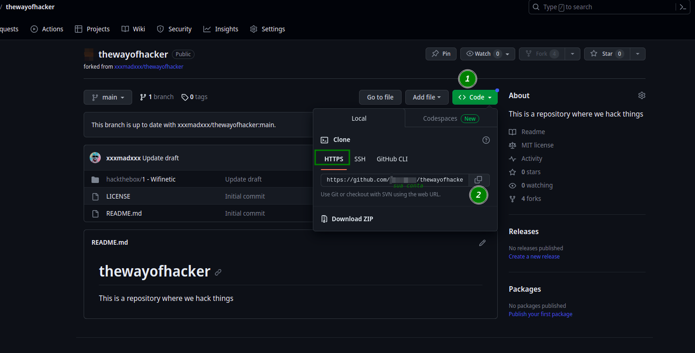

## Criando um fork

Nessa seção iremos mostrar como você pode contribuir com esse repositório. Primeiro de tudo é necessário ter uma conta no gitHub, estar logado com ela e ter o gitHub configuraedo em sua máquina. Esse passo a passo foi realizado em uma máquina linux.

1. **Crie um fork desse repositóriao**: Para criar um fork é necessário clicar na opção fork que tem na página inicial do repositorio. Conforme é mostrado na figura a seguir.

  

2. Após clicar no fork você será redirecionado para a página de riação do novo fork, conforme é mostrado a seguir:



note que o **Repository name** é o nome do repositório, iremos deixar dessa forma mesmo, agora só clicar no botão **Create fork** (passo 2). Após isso, o repositório será adicionado na sua conta do GitHub.

3. Iremos agora clone esse novo repositório na máquina.



para clone o repositório iremos clicar em **<> code** (passo 1) e depois iremos copiar a url que está em formato html (passo 2). Note que, no lugar **sua_conta**, terá o nome da sua conta.

```shell
https://github.com/sua_conta/thewayofhacker.git
 ```

Agora será necessário abrir o terminal da sua máquina e escrever: **git clone** e cole a url que tu copiou no passo 2. Dessa forma, será algo semelhante a isso:

```shell
git clone https://github.com/sua_conta/thewayofhacker.git
```

dê enter, se tudo der certo o repositório será clonado em sua máquina.

4. Use o comando **cd** para entrar no diretório:

```shell
cd thewayofhacker
```

## Criando as alterações

O último passo da seção anterior, foi de entrar no diretório, então iremos partir desse ponto.

1. Crie uma nova branch.

Antes de começar com as alterações é importante criar uma nova branch, para isso, use o seguinte comando:

```shell
git checkout -b nome_branch
```

troque o nome **nome_branch** pelo nome que fizer sentido, por exemplo, se for uma solução para o desafio 1, use:

```shell
git checkout -b feat/solucao_desafio_1_por_fulano_de_tal
```

2. **Faça suas alterações:**

   Faça as alterações desejadas nos arquivos.

3. **Adicione as alterações ao stage:**

   Use o comando `git add` para adicionar as alterações ao stage (às vezes chamado de "staging area"). Substitua `<NOME_DO_ARQUIVO>` pelo nome do arquivo que você deseja adicionar ou use `.` para adicionar todas as alterações:

   ```shell
   git add <NOME_DO_ARQUIVO>
   ```

   ou

   ```shell
   git add .
   ```

4. **Faça um commit das alterações:**

   Use o comando `git commit` para criar um commit com suas alterações. Inclua uma mensagem descritiva para o commit, explicando o que foi alterado:

   ```shell
   git commit -m "Descrição das alterações"
   ```

5. **Faça o push das alterações para o seu fork:**

   Use o comando `git push` para enviar as alterações para o seu fork no GitHub:

   ```shell
   git push origin nome_da_sua_branch
   ```

   Substitua `nome_da_sua_branch` pelo nome da branch em que você está trabalhando, então conforme a sugestão do nome de branch:

   ```shell
   git push origin feat/solucao_desafio_1_por_fulano_de_tal
   ```

6. **Abra um pull request (solicitação de pull):**

   Agora que suas alterações estão no seu fork no GitHub, você pode abrir um pull request para enviar essas alterações ao repositório original. Vá para a página do seu fork no GitHub e clique no botão "New pull request" (Novo pull request) para iniciar o processo.

## Fazendo o git pull para manter o seu fork atualizado

Para fazer um `git pull` do projeto original (upstream) no seu fork do repositório no GitHub, siga os passos abaixo:

1. Adicione o repositório original como um remote:
   Primeiro, você precisa adicionar o repositório original (upstream) como um remote no seu repositório fork. Para fazer isso, execute o seguinte comando:

   ```shell
   git remote add upstream https://github.com/xxxmadxxx/thewayofhacker.git
   ```

2. Verifique os remotes:

   Você pode verificar se o remote upstream foi adicionado corretamente usando o seguinte comando:

   ```shell
   git remote -v
   ```

   Isso deve listar tanto o remote `origin` (seu fork) quanto o `upstream` (repositório original).

3. Atualize o seu fork com o `git pull`:

   Agora que você adicionou o remote upstream, você pode usar o `git pull` para atualizar seu fork com as alterações do repositório original. Certifique-se de estar na sua branch local principal (atualmente é a `main`) antes de executar o comando:

   ```shell
   git pull upstream main
   ```

   Isso irá puxar as alterações da branch `main` do repositório original.

4. Resolva quaisquer conflitos (se necessário):

   Se houver conflitos entre as alterações no repositório original e as alterações em seu fork, você precisará resolvê-los. O Git irá ajudá-lo a resolver conflitos, e você deve seguir as instruções apresentadas pelo Git.

5. Faça um push das alterações atualizadas (se necessário):

   Após resolver conflitos (se houver), você deve fazer um push das alterações atualizadas para o seu fork:

   ```shell
   git push origin main
   ```

Com esses passos, você terá atualizado seu fork com as alterações do repositório original usando o `git pull`. Certifique-se de que seu fork esteja sincronizado regularmente para manter suas alterações atualizadas com o projeto original.
