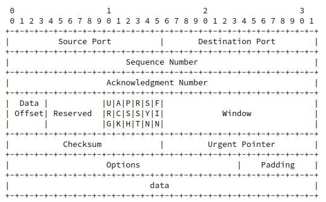
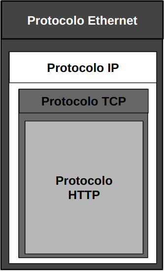
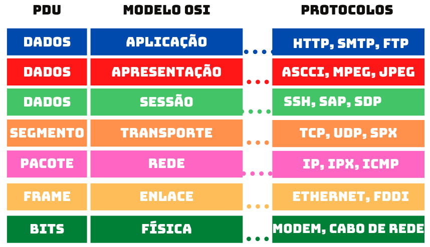

# Conteúdo teórico trabalhado na live

## Objetivos:

- Apresentar os conceitos teóricos para entender a aplicação prática.
- Resumo complementar.

**Obs.** É de suma importância assistir a live, esse material é apenas um complemento de algumas conversa que foram desenvolvidas no decorrer da solução do problema, esse material tem como objetivo ser um resumo complementar para auxiliar novos estudantes ou curiosos.

## Protocolo TCP

O Protocolo TCP (Transmission Control Protocol) é um dos principais protocolos de comunicação da Internet. A RFC (Request for Comments) que define o TCP é a RFC 793, intitulada "Transmission Control Protocol." Esta RFC descreve os detalhes do funcionamento do TCP, suas características e especificações técnicas. Esse protocolo faz parte da camada de transporte do Modelo OSI e é responsável por garantir a entrega confiável e ordenada de dados entre dispositivos em uma rede. O TCP é amplamente utilizado em aplicativos que requerem transferência de dados confiável, como navegação na web, envio de e-mails e transferência de arquivos.

A figura a seguir mostra a composição original de seu cabeçalho:

Os Campos Source Port e Destination Port, são respectivamente porta de origem e porta de destino.

São vários aspectos interessantes que podemos notar nesses campos, no caso da porta de origem temos os seguinte:

1. **Identificação do Processo de Origem**: A porta de origem é um número de 16 bits, assim seu valor poderá ir de 0000000000000000 (0 em decimal) a 1111111111111111 (65535 em decimal). Uma observação, a porta 0 é reservada pela IANA e não deverá ser usada.

2. **Portas Bem Conhecidas**: Existem portas de origem "bem conhecidas" que são reservadas para serviços específicos e amplamente reconhecidos. Por exemplo, a porta 80 é comumente usada para o tráfego da web (HTTP), a porta 25 para envio de e-mails (SMTP), a porta 22 para acesso SSH e assim por diante. Essas portas facilitam a identificação rápida dos serviços em execução.

3. **Portas Efêmeras**: Além das portas bem conhecidas, existem portas efêmeras (também conhecidas como portas dinâmicas) que são atribuídas aleatoriamente pelo sistema operacional ou pela aplicação cliente para uma conexão específica. Essas portas são temporárias e são usadas para estabelecer uma conexão única.

4. **Identificação Única**: O par formado pela combinação de endereço IP de origem e porta de origem, juntamente com o endereço IP de destino e porta de destino, é chamado de "soquete" ou "socket". Ele cria uma identificação única para cada conexão em uma rede, permitindo que múltiplas conexões de diferentes aplicativos ocorram ao mesmo tempo no mesmo dispositivo.

5. **NAT (Network Address Translation)**: O campo de porta de origem é especialmente importante em ambientes onde ocorre a tradução de endereço de rede (NAT). Em sistemas NAT, o endereço IP de origem é traduzido para um único endereço IP público, mas as portas de origem são usadas para manter o rastreamento de qual conexão interna corresponde a qual conexão externa.

6. **Segurança**: A porta de origem é uma parte crítica para a segurança, pois permite que os dispositivos de rede identifiquem quais aplicativos estão gerando tráfego. Isso é usado em firewalls e sistemas de filtragem para permitir ou bloquear tráfego com base nas portas de origem e destino.

Principais características do TCP:

1. **Confiabilidade**: O TCP é projetado para garantir que os dados enviados de um dispositivo sejam entregues com precisão e em ordem no dispositivo de destino. Ele usa um mecanismo de confirmação (ACK - Acknowledgment) para confirmar a entrega de pacotes e solicita retransmissões de pacotes perdidos.

2. **Controle de Fluxo**: O TCP monitora a taxa de transferência dos dados e ajusta a velocidade de envio para evitar congestionamentos na rede. Isso é feito usando janelas deslizantes e técnicas de controle de congestionamento.

3. **Orientado à Conexão**: O TCP estabelece uma conexão antes da transferência de dados e a encerra após a conclusão. Isso garante que ambas as partes estejam prontas para a troca de dados.

4. **Portas e Segmentação**: O TCP utiliza números de porta para distinguir diferentes aplicativos em um dispositivo e divide os dados em segmentos para transmissão eficiente.

Se você deseja obter informações mais detalhadas sobre o TCP, você pode consultar a RFC 793 diretamente através do seguinte link: [RFC 793 - Transmission Control Protocol](https://www.rfc-editor.org/rfc/rfc793).

## Modelo OSI

Tudo começou com o ip da máquina do nosso desafio, pois, não podemos simplesmente ir implementando várias ferramentas sem saber os conceitos, isso não é ser hacker ;). Vamos tentar ativar o modo hacker em cada um de nós, rs. Você já se perguntou como acontece toda a comunicação na internet? Como um máquina sabe da existência de outra máquina? Ou qual são as camadas do Modelo OSI? Mas ... o que é o Modelo OSI?

A base do Modelo OSI é um protocolo sendo encapsulado pelo outro, conforme a fig 1.

O modelo OSI é uma estrutura conceitual que divide as funções de comunicação em camadas, facilitando a compreensão do funcionamento da rede. Para análise de tráfego eficaz, é necessário compreender como os protocolos operam em cada uma dessas camadas. A figura a seguir, mostra o Modelo OSI e alguns elementos conhecidos nas camadas.

Como podemos ver na imagem a cima ( e como foi mostrado na live) o Modelo OSI é dividido em sete camadas, cada uma com sua função específica.

7. **Camada de Aplicação (Application Layer)**: A camada de aplicação é a camada mais alta e está relacionada diretamente com os aplicativos e serviços que os usuários finais utilizam para interagir com a rede. Ela fornece serviços de rede diretamente aos aplicativos, como HTTP (para a web), FTP (para transferência de arquivos) e SMTP (para e-mail).

6. **Camada de Apresentação (Presentation Layer)**: A camada de apresentação é responsável pela formatação e tradução dos dados para que possam ser compreendidos pelo receptor. Ela também lida com a criptografia e compressão de dados, se necessário.

5. **Camada de Sessão (Session Layer)**: A camada de sessão estabelece, gerencia e encerra as sessões de comunicação entre os dispositivos. Ela também lida com a sincronização e o controle do diálogo entre os aplicativos.

4. **Camada de Transporte (Transport Layer)**: A camada de transporte é responsável por garantir a entrega confiável dos dados entre as extremidades da comunicação. Ela lida com o controle de fluxo, segmentação e recombinação de dados e controle de erros. Os protocolos TCP (Transmission Control Protocol) e UDP (User Datagram Protocol) operam nesta camada.

3. **Camada de Rede (Network Layer)**: A camada de rede é responsável pela roteamento dos dados na rede. Ela decide o caminho que os pacotes de dados devem seguir para alcançar seu destino. O protocolo IP (Internet Protocol) é uma parte importante desta camada.

2. **Camada de Enlace de Dados (Data Link Layer)**: A camada de enlace de dados lida com a comunicação direta entre dispositivos conectados diretamente, como switches e placas de rede. Ela também controla o fluxo de dados e realiza a detecção e correção de erros.

1. **Camada Física (Physical Layer)**: Esta é a camada mais baixa e trata da transmissão física dos dados através do meio de comunicação, como cabos, fibras ópticas e sinais elétricos. Ela define características como tensão, frequência e taxa de transferência física.

Cada camada do Modelo OSI tem uma função específica e se comunica com as camadas adjacentes para garantir a transferência eficaz e confiável de dados em uma rede de computadores.

## Resumo: Análise de Tráfego de Rede

A análise de tráfego de rede é uma prática essencial para a manutenção e segurança de redes de computadores. Ela fornece insights valiosos sobre o funcionamento da rede e pode ajudar na detecção de problemas, anomalias e até mesmo ameaças de segurança. Nesta documentação, abordaremos os principais aspectos da análise de tráfego.

### RFCs - Recursos Essenciais

Para entender os protocolos de rede em detalhes, é crucial consultar as RFCs (Request for Comments). As RFCs são documentos técnicos que descrevem os padrões e especificações de protocolos de rede e regulam o funcionamento da Internet. Você pode encontrá-las em https://www.ietf.org/standards/rfcs/.

Por exemplo, se desejamos entender o funcionamento do Hypertext Transfer Protocol (HTTP) na versão 1.1, podemos procurar pela RFC 2616:

[RFC 2616 - HTTP/1.1](https://www.rfc-editor.org/rfc/rfc2616)

Existem várias RFCs relevantes para a análise de tráfego, incluindo:

- RFC 768: UDP (User Datagram Protocol)
- RFC 791: IP (Internet Protocol)
- RFC 792: ICMP (Internet Control Message Protocol)
- RFC 793: TCP (Transmission Control Protocol)
- RFC 1122: Requisitos de Host na Internet
- RFC 6890: Princípios Básicos do IPv6
- RFC 8200: IPv6

Certifique-se de consultar as RFCs mais recentes para obter informações atualizadas sobre os protocolos de rede.

### Ferramentas para Análise de Tráfego

Para realizar a análise de tráfego de rede, você pode utilizar várias ferramentas. Duas das mais populares são:

1. **tcpdump**: Uma ferramenta de linha de comando que permite capturar e analisar pacotes de rede em tempo real. É uma escolha poderosa para análise detalhada.

2. **Wireshark**: Uma ferramenta de análise de pacotes de rede com uma interface gráfica amigável. Wireshark oferece recursos avançados de filtragem e análise.

Certifique-se de compreender como usar essas ferramentas e como interpretar os dados capturados para obter informações valiosas sobre o tráfego de rede.

## Referências

1. João Eriberto Mota Filho - Análise de Tráfego em Redes TCP/IP: Utilize Tcpdump na Análise de Tráfegos em Qualquer Sistema Operacional.
2. João Eriberto Mota Filho: Aula 1 - https://www.youtube.com/watch?v=gK3gl3Vh8L0